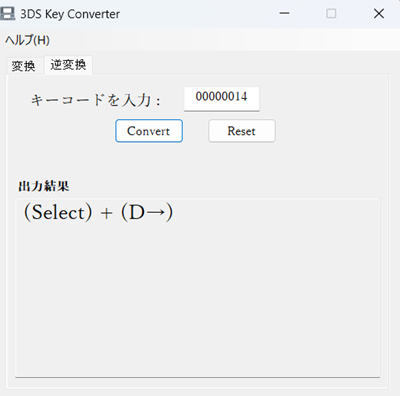

# KeyConverter

このアプリケーションは、3DSのキーコードを変換・逆変換するためのプログラムです。
キーコードの詳細は、(こちら)[https://gist.github.com/Nanquitas/d6c920a59c757cf7917c2bffa76de860#file-actionreplaycodetypes-txt]を確認してください。

## ■著作権表示

Copyright (C) 2022 アーム